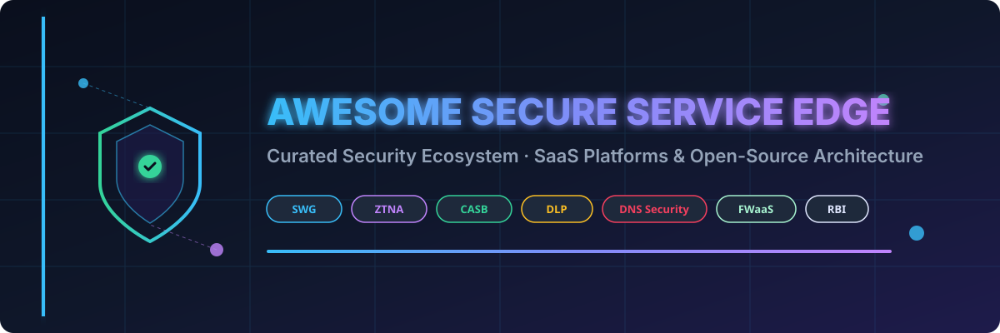
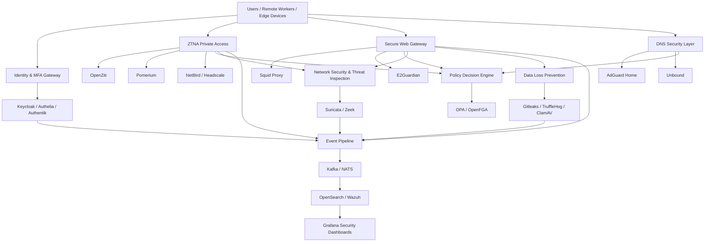

# 🛡️ Awesome Secure Service Edge (SSE)

  
  
  
  
  
  

> **Curated Ecosystem of SaaS/Hosted Platforms & Open-Source Security Architecture**
> *Comprehensive guide covering Secure Web Gateway (SWG), Zero Trust Network Access (ZTNA), Cloud Access Security Broker (CASB), Data Loss Prevention (DLP), DNS Security, Firewall-as-a-Service (FWaaS), Remote Browser Isolation (RBI), and Cloud Security.*

---

## 📌 Executive Overview & SEO Index

**Security Service Edge (SSE)** represents the security pillar of **Secure Access Service Edge (SASE)** architecture as defined by Gartner. SSE converges cloud-delivered security capabilities—such as **Secure Web Gateway (SWG)**, **Zero Trust Network Access (ZTNA)**, **Cloud Access Security Broker (CASB)**, **Data Loss Prevention (DLP)**, **DNS Security**, and **Remote Browser Isolation (RBI)**—into a unified cloud framework.

This repository tracks both **commercial enterprise SaaS solutions** and **open-source building blocks** for security architects, CISOs, DevOps, DevSecOps, and network engineers building enterprise security stacks.

---

## 📑 Table of Contents

- [☁️ SaaS & Hosted Platforms](#️-saas--hosted-platforms)
- [💻 Open-Source GitHub Projects](#-open-source-github-projects)
- [🛡️ Open-Source Zero Trust & ZTNA](#️-open-source-zero-trust--ztna)
- [🌐 Open-Source Secure Web Gateway & Proxy](#-open-source-secure-web-gateway--proxy)
- [🔒 Open-Source DNS & Network Security](#-open-source-dns--network-security)
- [🔑 Open-Source Identity & Access Management (IAM)](#-open-source-identity--access-management-iam)
- [📄 Open-Source DLP & Data Security](#-open-source-dlp--data-security)
- [📊 Open-Source Security Monitoring & Analytics](#-open-source-security-monitoring--analytics)
- [🔄 Commercial SSE → Open-Source Equivalents](#-commercial-sse--open-source-equivalents)
- [🏗️ Frameworks for Building Custom SSE Systems](#️-frameworks-for-building-custom-sse-systems)
- [📐 Reference Open-Source SSE Architecture](#-reference-open-source-sse-architecture)
- [🎯 Recommended Open-Source SSE Stack](#-recommended-open-source-sse-stack)
- [📊 SSE Capability Matrix](#-sse-capability-matrix)
- [❓ What Is Still Difficult to Reproduce in Open Source?](#-what-is-still-difficult-to-reproduce-in-open-source)
- [📈 Star History](#-star-history)
- [🤝 How to Contribute](#-how-to-contribute)
- [⚠️ Disclaimer](#️-disclaimer)

---

## ☁️ SaaS & Hosted Platforms

> 📊 **Market Insights**: The global Security Service Edge (SSE) sector is estimated at **$9.5 Billion – $14.0 Billion** (projected to exceed ~$25B+ by 2030 at a CAGR of ~22–25%). The sector is **moderately fragmented**, actively transitioning from legacy point-solution appliances toward consolidated cloud-native SSE/SASE platforms led by cybersecurity market leaders and hyper-scaler ecosystems.

The table below lists leading SaaS SSE vendors **sorted in descending order by company valuation / annual market capitalization**:

| Platform 🏢 | Description 📝 | Company Size / Valuation 💰 | Starting Pricing 💵 | Free Tier / Trial Limit 🎁 |
| :--- | :--- | :--- | :--- | :--- |
| **[Broadcom Symantec SSE](https://www.broadcom.com/products/cybersecurity/network-security)** | Enterprise cloud security portfolio covering secure web access, CASB, DLP and related security controls. | **~$800B+ Market Cap** (~$50B+ Rev) | ~$3.50 / user / month ($42 / user / year base Web Security Service suite) | 90-day free trial (enterprise Proof of Concept license via Broadcom Support Portal with Site ID) |
| **[Cisco Secure Access / Cisco Umbrella](https://umbrella.cisco.com/)** | Cisco's SSE capabilities combine Secure Internet Access and Secure Private Access, with DNS security, SWG, CASB, DLP, malware protection and ZTNA capabilities. | **~$200B+ Market Cap** (~$53.8B Rev) | $2.25 / user / month (DNS Security Essentials starting tier; $4.00 / user / month for SIG) | 14-day free trial (standard self-service trial up to 50 users; 21 days for MSP partners) |
| **[Palo Alto Networks Prisma Access](https://www.paloaltonetworks.com/sase/access)** | Cloud-delivered security platform combining secure access, SWG, ZTNA, cloud security, threat prevention and enterprise networking. | **~$115B+ Market Cap** (~$8.0B Rev) | ~$8.00 / user / month ($96 / user / year starting tier for base ZTNA/SWG package) | 30-day free trial (Ultimate Test Drive hands-on lab and guided PoC tenant evaluation) |
| **[FortiSASE](https://www.fortinet.com/products/sase)** | Cloud-delivered SASE/SSE capabilities including SWG, ZTNA, CASB, FWaaS and endpoint/security integration. | **~$55B+ Market Cap** (~$5.3B Rev) | $7.50 / user / month ($90 / user / year starting tier for Standard package, min 50 users) | 30-day free trial (PoC tenant managed via Fortinet partner for minimum 50 user evaluation) |
| **[Cloudflare One](https://www.cloudflare.com/zero-trust/)** | Zero Trust/SASE platform combining secure web access, private application access, DNS filtering, network security, browser isolation and data protection. | **~$30B+ Market Cap** (~$1.5B Rev) | $0 / month (Free tier) / $7.00 / user / month (Standard Pay-as-you-go tier) | Free forever for up to 50 users (includes ZTNA, SWG, WARP client, DEX, basic CASB/DLP, 24h log retention) |
| **[Zscaler Zero Trust Exchange](https://www.zscaler.com/products/zero-trust-exchange)** | Cloud-native security platform providing secure internet and private-application access, SWG, CASB, DLP and zero-trust controls. | **~$28B+ Market Cap** (~$2.1B Rev) | ~$2.40 / user / month ($72 / user / year starting tier for ZIA Business package) | 90-day free trial (ZIA Cloud Sandbox/DLP evaluation, or 30-day PoC tenant with full feature access) |
| **[Netskope One SSE](https://www.netskope.com/products/security-service-edge)** | Cloud-delivered SSE platform combining SWG, CASB, DLP, zero-trust access and threat protection with granular policy and data-centric controls. | **~$7.5B Valuation** (~$500M+ ARR) | ~$4.00 / user / month ($48 / user / year base SWG + CASB package) | 14-day free trial (Netskope Private Access Test Drive & PoV hands-on lab for up to 50 test users) |
| **[Cato Networks](https://www.catonetworks.com/)** | Cloud-native SASE platform combining networking and security services including SWG, CASB, ZTNA, FWaaS and SD-WAN. | **~$3.1B Valuation** (~$200M+ ARR) | ~$6.00 / user / month (ZTNA SDP remote user starting tier) or ~$100.00 / site / month | 30-day free trial (Proof of Concept tenant with full SASE/SSE features enabled across all test sites) |
| **[Forcepoint ONE](https://www.forcepoint.com/product/forcepoint-one)** | Cloud-native SSE platform focused on SWG, CASB, DLP, private application access and data-centric security. | **~$2.0B Valuation** (~$450M Rev) | ~$4.58 / user / month ($55 / user / year starting tier for cloud modules, min 100 users) | 30-day free trial (guided evaluation PoC environment for up to 100 test users) |
| **[Skyhigh Security](https://www.skyhighsecurity.com/)** | SSE platform emphasizing SWG, CASB, DLP, zero-trust access, cloud security and data protection. | **~$1.8B Valuation** (~$300M Rev) | ~$5.00 / user / month ($60 / user / year starting tier for base Cloud Protection/SWG suite) | 14-day free trial (interactive guided PoC lab environment with pre-configured DLP & CASB policies) |
| **[Lookout Secure Cloud Access / SSE](https://www.lookout.com/products/security-service-edge)** | Cloud security platform emphasizing secure access, data protection, DLP, CASB and zero-trust capabilities. | **~$1.0B Valuation** (~$120M Rev) | ~$4.00 / user / month (starting tier for base cloud access and mobile endpoint protection) | 90-day free trial (for Mobile Endpoint & Cloud Access evaluation up to 50 devices/users) |
| **[Versa SASE](https://www.versa-networks.com/sase/)** | Integrated SASE/SSE platform combining SD-WAN, SWG, CASB, ZTNA, firewall and security analytics. | **~$1.0B Valuation** (~$100M ARR) | $7.50 / user / month (entry subscription tier for ZTNA and cloud security services) | 90-day free trial (evaluation tenant capped at up to 100 users or enterprise PoC trial) |
| **[iboss](https://www.iboss.com/)** | Cloud-delivered SSE/SASE platform providing SWG, ZTNA, CASB, DLP and secure internet access. | **~$600M Valuation** (~$90M Rev) | ~$2.50 / user / month ($30 / user / year starting tier for Zero Trust Core package) | 30-day free trial (evaluation PoC license for cloud gateway & zero-trust access) |
| **[Cloudi-Fi](https://www.cloudi-fi.com/)** | Cloud-based secure access and filtering platform with security-policy and internet-access use cases. | **~$75M Valuation** (~$15M Rev) | $1.50 / user / month (or ~$50.00 / site / month base access plan) | 30-day free trial (freemium option for 1 site under fair-use policy limits) |

---

## 💻 Open-Source GitHub Projects

> **Building Block Principle**: While no single open-source project provides 1:1 feature parity with commercial SSE suites, an enterprise-grade open-source SSE stack is built by combining complementary building blocks (ZTNA, SWG, DNS, IAM, DLP, Monitoring).

The table below lists top open-source projects **sorted in descending order by GitHub star count**:

| Repository 📦 | GitHub_Stars 🌟 | Description & SSE Role 🚀 |
| :--- | :--- | :--- |
| **[Grafana](https://github.com/grafana/grafana)** |  | Operational dashboards and visualization for security metrics and logs. |
| **[Prometheus](https://github.com/prometheus/prometheus)** |  | Systems monitoring and time-series alerting database. |
| **[Traefik](https://github.com/traefik/traefik)** |  | Modern HTTP reverse proxy and load balancer for microservices. |
| **[Pi-hole](https://github.com/pi-hole/pi-hole)** |  | DNS sinkhole for network-wide ad and threat domain blocking. |
| **[Headscale](https://github.com/juanfont/headscale)** |  | Self-hosted control server for Tailscale WireGuard networks. |
| **[Trivy](https://github.com/aquasecurity/trivy)** |  | Comprehensive vulnerability, secret, and misconfiguration scanner. |
| **[AdGuard Home](https://github.com/AdguardTeam/AdGuardHome)** |  | Network-wide DNS server for blocking ads, tracking, and malicious domains. |
| **[Keycloak](https://github.com/keycloak/keycloak)** |  | Open-source IAM, SSO, user federation, SAML/OIDC and fine-grained authorization. |
| **[Tailscale](https://github.com/tailscale/tailscale)** |  | Cross-platform mesh VPN and zero-trust overlay network client. |
| **[HashiCorp Vault](https://github.com/hashicorp/vault)** |  | Secrets management, encryption-as-a-service, and privileged access. |
| **[Apache Kafka](https://github.com/apache/kafka)** |  | Distributed event-streaming platform for security logs. |
| **[Gitleaks](https://github.com/gitleaks/gitleaks)** |  | SAST tool for detecting hardcoded secrets and sensitive credentials. |
| **[NetBird](https://github.com/netbirdio/netbird)** |  | WireGuard-based overlay networking with centralized access policies & SSO/MFA. |
| **[Envoy Proxy](https://github.com/envoyproxy/envoy)** |  | Cloud-native high-performance edge/service proxy. |
| **[Authelia](https://github.com/authelia/authelia)** |  | Authentication and authorization server providing SSO, MFA, and passkeys. |
| **[TruffleHog](https://github.com/trufflesecurity/trufflehog)** |  | High-efficiency secret scanner for git repositories and filesystems. |
| **[Authentik](https://github.com/goauthentik/authentik)** |  | Open-source identity provider integrating SSO, MFA, and user management. |
| **[Cilium](https://github.com/cilium/cilium)** |  | eBPF-based networking, security, and observability for cloud native. |
| **[Vector](https://github.com/vectordotdev/vector)** |  | High-performance observability data pipeline for log aggregation. |
| **[ThingsBoard](https://github.com/thingsboard/thingsboard)** |  | IoT device management platform with security telemetry components. |
| **[Teleport](https://github.com/gravitational/teleport)** |  | Identity-aware infrastructure and application access gateway. |
| **[NATS Server](https://github.com/nats-io/nats-server)** |  | High-performance cloud-native messaging system. |
| **[ORY Hydra](https://github.com/ory/hydra)** |  | API-first OAuth2 and OpenID Connect authorization server. |
| **[Wazuh](https://github.com/wazuh/wazuh)** |  | Unified open-source XDR, SIEM, and endpoint security monitoring platform. |
| **[Cloudflared](https://github.com/cloudflare/cloudflared)** |  | Cloudflare Tunnel client for secure ZTNA app exposure. |
| **[CrowdSec](https://github.com/crowdsecurity/crowdsec)** |  | Open-source collaborative IPS and threat-detection engine. |
| **[OpenVPN](https://github.com/OpenVPN/openvpn)** |  | Enterprise open-source VPN daemon and secure tunnel infrastructure. |
| **[CoreDNS](https://github.com/coredns/coredns)** |  | Extensible DNS server useful for cloud policy and service discovery. |
| **[ORY Kratos](https://github.com/ory/kratos)** |  | Cloud-native identity and user management system. |
| **[OpenSearch](https://github.com/opensearch-project/OpenSearch)** |  | Distributed search and security analytics engine. |
| **[OPA](https://github.com/open-policy-agent/opa)** |  | General-purpose policy engine for unified policy enforcement across stacks. |
| **[ModSecurity](https://github.com/owasp-modsecurity/ModSecurity)** |  | Open-source web application firewall (WAF) engine. |
| **[Falco](https://github.com/falcosecurity/falco)** |  | Cloud-native runtime security and threat detection tool. |
| **[Fluent Bit](https://github.com/fluent/fluent-bit)** |  | Fast and lightweight log and metrics processor/forwarder. |
| **[Zeek](https://github.com/zeek/zeek)** |  | Network security monitoring framework providing detailed network telemetry. |
| **[OpenTelemetry Collector](https://github.com/open-telemetry/opentelemetry-collector)** |  | Vendor-neutral telemetry collector for logs, metrics, and traces. |
| **[OpenBao](https://github.com/openbao/openbao)** |  | Community-driven open-source secret management platform. |
| **[ClamAV](https://github.com/Cisco-Talos/clamav)** |  | Open-source antivirus engine for file scanning and malware detection. |
| **[HAProxy](https://github.com/haproxy/haproxy)** |  | Reliable, high-performance TCP/HTTP load balancer and proxy. |
| **[Suricata](https://github.com/OISF/suricata)** |  | High-performance Network IDS, IPS, and network security monitoring engine. |
| **[OpenFGA](https://github.com/openfga/openfga)** |  | Fine-grained relationship-based authorization engine inspired by Zanzibar. |
| **[ORY Keto](https://github.com/ory/keto)** |  | First open-source implementation of Google Zanzibar Access Control. |
| **[Pomerium](https://github.com/pomerium/pomerium)** |  | Identity- and context-aware access proxy for internal application zero-trust access. |
| **[Tetragon](https://github.com/cilium/tetragon)** |  | eBPF-based security observability and runtime enforcement. |
| **[Unbound](https://github.com/NLnetLabs/unbound)** |  | Validating, recursive, caching DNS resolver. |
| **[WireGuard](https://github.com/WireGuard/wireguard-go)** |  | Lightweight, high-performance encrypted networking foundation. |
| **[OpenZiti](https://github.com/openziti/ziti)** |  | Identity-based zero-trust networking platform providing app access & encrypted segmentation. |
| **[Coraza WAF](https://github.com/corazawaf/coraza)** |  | Modern OWASP ModSecurity-compatible web application firewall engine in Go. |
| **[Squid Proxy](https://github.com/squid-cache/squid)** |  | Caching and forwarding HTTP web proxy for secure traffic filtering. |
| **[strongSwan](https://github.com/strongswan/strongswan)** |  | IPsec-based multi-platform VPN software. |
| **[OpenSearch Dashboards](https://github.com/opensearch-project/OpenSearch-Dashboards)** |  | Visualization interface for OpenSearch security logs. |
| **[E2Guardian](https://github.com/e2guardian/e2guardian)** |  | Open-source web content filtering proxy supporting ICAP and transparent mode. |
| **[Web Safety for Squid](https://github.com/diladele/websafety)** |  | Web filtering and administration layer for Squid proxy with HTTPS inspection. |

---

## 🛡️ Open-Source Zero Trust & ZTNA

### ⚡ OpenZiti
**[OpenZiti](https://github.com/openziti/ziti)** is one of the strongest open-source foundations for building the **ZTNA/private-access portion** of an SSE platform.
- Zero-trust overlay networking & identity-based application access
- Cryptographic identity & policy-controlled service access
- End-to-end encrypted connectivity & application SDKs
- License: Apache-2.0

### 🛡️ Pomerium
**[Pomerium](https://github.com/pomerium/pomerium)** provides identity- and context-aware proxying for internal web applications.
- Clientless web application access & OIDC integration
- Context-aware policy enforcement without exposed VPN ports
- License: Apache-2.0

### 🦅 NetBird
**[NetBird](https://github.com/netbirdio/netbird)** combines WireGuard overlay networking with centralized policy controls and SSO/MFA integrations.

### 🌐 Headscale & Tailscale
**[Headscale](https://github.com/juanfont/headscale)** offers an open-source, self-hosted control server for **[Tailscale](https://github.com/tailscale/tailscale)** clients.

---

## 🌐 Open-Source Secure Web Gateway & Proxy

### 🦑 Squid & E2Guardian
- **[Squid](https://github.com/squid-cache/squid)**: High-performance caching proxy serving as the forward proxy interception layer.
- **[E2Guardian](https://github.com/e2guardian/e2guardian)**: Web content filtering engine with HTTPS inspection and ICAP support.
- **[Web Safety for Squid](https://github.com/diladele/websafety)**: Administration and Web UI layer around Squid.

### 🛡️ ModSecurity & Coraza WAF
- **[ModSecurity](https://github.com/owasp-modsecurity/ModSecurity)**: Standard WAF engine for HTTP traffic inspection.
- **[Coraza WAF](https://github.com/corazawaf/coraza)**: Enterprise-ready OWASP ModSecurity-compatible Go WAF engine.

---

## 🔒 Open-Source DNS & Network Security

- **[AdGuard Home](https://github.com/AdguardTeam/AdGuardHome)**: Network-wide DNS server for advertisement, malware, and tracker blocking.
- **[Pi-hole](https://github.com/pi-hole/pi-hole)**: Lightweight DNS sinkhole for network security policy enforcement.
- **[Unbound](https://github.com/NLnetLabs/unbound)**: High-performance validating, caching DNS resolver.
- **[CoreDNS](https://github.com/coredns/coredns)**: Extensible DNS server written in Go, widely used in Kubernetes and cloud environments.

---

## 🔑 Open-Source Identity & Access Management (IAM)

- **[Keycloak](https://github.com/keycloak/keycloak)**: Complete IAM solution providing SSO, OAuth2/OIDC, SAML, and user federation.
- **[Authelia](https://github.com/authelia/authelia)**: Lightweight authentication gateway supporting SSO, MFA, and WebAuthn passkeys.
- **[Authentik](https://github.com/goauthentik/authentik)**: Modern identity provider with flexible workflow pipeline builder.
- **[OPA (Open Policy Agent)](https://github.com/open-policy-agent/opa)**: General-purpose policy engine for fine-grained authorization.

---

## 📄 Open-Source DLP & Data Security

- **[Gitleaks](https://github.com/gitleaks/gitleaks)**: SAST secret scanner for credentials and sensitive data.
- **[TruffleHog](https://github.com/trufflesecurity/trufflehog)**: High-efficiency secret scanner for filesystems and repositories.
- **[ClamAV](https://github.com/Cisco-Talos/clamav)**: Antivirus engine for scanning uploads and transferred files.
- **[HashiCorp Vault](https://github.com/hashicorp/vault)** / **[OpenBao](https://github.com/openbao/openbao)**: Secrets and key management infrastructure.

---

## 📊 Open-Source Security Monitoring & Analytics

- **[Suricata](https://github.com/OISF/suricata)**: High-performance Network IDS/IPS engine.
- **[Zeek](https://github.com/zeek/zeek)**: Deep network security monitoring and telemetry framework.
- **[Wazuh](https://github.com/wazuh/wazuh)**: Endpoint security, SIEM, and vulnerability detection.
- **[OpenSearch](https://github.com/opensearch-project/OpenSearch)** & **[Grafana](https://github.com/grafana/grafana)**: Analytics indexing and dashboard visualization.

---

## 🔄 Commercial SSE → Open-Source Equivalents

| Commercial Platform 🏢 | Primary Capabilities 🛠️ | Open-Source Building Blocks 🧩 |
| :--- | :--- | :--- |
| **Netskope One SSE** | SWG + CASB + DLP + ZTNA | Squid + E2Guardian + OpenZiti + Keycloak + OPA + Suricata |
| **Zscaler Exchange** | SWG + ZTNA + CASB + DLP | Squid + E2Guardian + OpenZiti + Pomerium + Keycloak |
| **Cisco Secure Access** | DNS + SWG + ZTNA + CASB | AdGuard Home + Squid + OpenZiti + Keycloak + Suricata |
| **Palo Alto Prisma Access** | SASE + SWG + ZTNA + Threat Prev | OpenZiti + Squid + Suricata + OPA + Keycloak |
| **Cloudflare One** | Zero Trust + SWG + DNS + ZTNA | OpenZiti + Pomerium + AdGuard Home + Squid + Keycloak |
| **Cato Networks** | SASE + SWG + ZTNA + FWaaS | OpenZiti + NetBird + Squid + Suricata + OPA |
| **Forcepoint ONE** | SWG + CASB + DLP | Squid + E2Guardian + OPA + Gitleaks + ClamAV |
| **Skyhigh Security** | SWG + CASB + DLP + ZTNA | Squid + OpenZiti + Keycloak + OPA + Suricata |
| **Versa SASE** | SD-WAN + SWG + ZTNA + Firewall | OpenZiti + NetBird + Squid + Suricata + OPA |
| **Lookout SSE** | ZTNA + CASB + DLP + Mobile Sec | OpenZiti + Pomerium + Keycloak + OPA + TruffleHog |
| **iboss** | Cloud SWG + ZTNA + DLP | Squid + E2Guardian + OpenZiti + OPA |
| **FortiSASE** | SWG + ZTNA + Firewall + CASB | Squid + OpenZiti + Suricata + OPA |

---

## 🏗️ Frameworks for Building Custom SSE Systems

| Architectural Layer 📐 | Open-Source Technologies 🛠️ |
| :--- | :--- |
| **Identity & IAM** | Keycloak · Authentik · Authelia |
| **Multi-Factor Auth** | Authelia · Keycloak · WebAuthn Passkeys |
| **ZTNA & Private Access** | OpenZiti · Pomerium · NetBird · Tailscale |
| **Overlay Mesh Network** | WireGuard · NetBird · Headscale |
| **Secure Web Gateway** | Squid Proxy · E2Guardian · Web Safety |
| **DNS Filtering & Security** | AdGuard Home · Pi-hole · Unbound · CoreDNS |
| **Policy Decision Engine** | OPA (Open Policy Agent) · OpenFGA · ORY Keto |
| **WAF / Web Protection** | ModSecurity · Coraza WAF · Traefik |
| **Network IDS/IPS** | Suricata · CrowdSec |
| **Network Telemetry** | Zeek |
| **Endpoint / XDR / SIEM** | Wazuh |
| **DLP & Data Security** | Gitleaks · TruffleHog · ClamAV |
| **Secrets Management** | OpenBao · HashiCorp Vault |
| **Log & Event Pipeline** | Apache Kafka · Vector · Fluent Bit |
| **Security Analytics** | OpenSearch · Grafana · Prometheus |

---

## 📐 Reference Open-Source SSE Architecture

---

## 🎯 Recommended Open-Source SSE Stack

For teams building a production self-hosted SSE stack, the recommended component combination is:
- **Identity**: `Keycloak + Authelia`
- **ZTNA**: `OpenZiti + Pomerium`
- **Secure Web Gateway**: `Squid + E2Guardian`
- **DNS Security**: `AdGuard Home + Unbound`
- **Policy Engine**: `OPA + OpenFGA`
- **Network Security**: `Suricata + Zeek`
- **Data Protection**: `Gitleaks + TruffleHog + ClamAV`
- **SIEM & Analytics**: `Wazuh + OpenSearch + Grafana`

---

## 📊 SSE Capability Matrix

| Capability 🛠️ | Commercial SSE ☁️ | Open-Source Equivalent Stack 💻 |
| :--- | :---: | :--- |
| Secure Web Gateway | ✓ | Squid + E2Guardian |
| URL Content Filtering | ✓ | E2Guardian + Squid |
| DNS Security | ✓ | AdGuard Home + Unbound |
| ZTNA & Private App Access | ✓ | OpenZiti + Pomerium |
| VPN Replacement Overlay | ✓ | OpenZiti + NetBird |
| Identity & IAM | ✓ | Keycloak + Authentik |
| Multi-Factor Authentication | ✓ | Keycloak + Authelia |
| Data Loss Prevention | ✓ | Gitleaks + TruffleHog + ClamAV |
| Malware Inspection | ✓ | ClamAV + Suricata |
| Network IDS/IPS | ✓ | Suricata |
| Network Telemetry | ✓ | Zeek |
| WAF / Threat Prevention | ✓ | ModSecurity + Coraza |
| Policy Decision Engine | ✓ | OPA + OpenFGA |
| SIEM & XDR | ✓ | Wazuh + OpenSearch |
| Observability Dashboards | ✓ | OpenSearch + Grafana |

---

## ❓ What Is Still Difficult to Reproduce in Open Source?

While building blocks exist for individual security modules, commercial SSE suites still offer advantages in:
- Globally distributed security Points of Presence (POPs)
- Real-time global threat intelligence integration
- Scalable inline SSL/TLS inspection at enterprise scale
- Turnkey Cloud Access Security Broker (CASB) application catalogs
- Enterprise-wide managed Browser Isolation (RBI) infrastructure

---

## 📈 Star History

---

## 🤝 How to Contribute

1. Fork this repository.
2. Add/edit entries in `README.md` following the tabular layout.
3. Check out the list of awesome lists at **[Awesome Awesome Awesome](https://github.com/ishandutta2007/Awesome-Awesome-Awesome)**.
4. Ensure entries include project name, official GitHub repository link, star count badge, and accurate description.
5. Submit a pull request with a concise title and summary!

---

## ⚠️ Disclaimer

- This list is **community-curated** for educational, architectural, and security evaluation purposes.
- Commercial trademarks belong to their respective owners.
- Self-hosted SSE implementations require professional security architecture, monitoring, certificate management, and compliance reviews.
