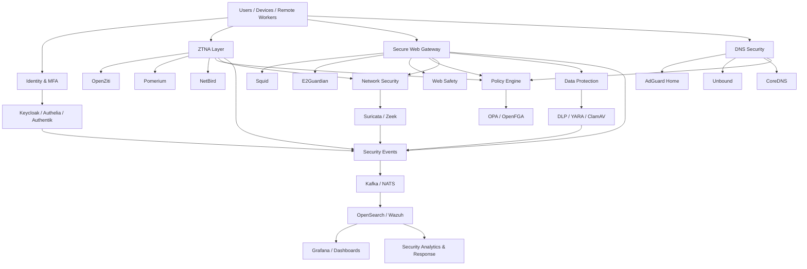

# Awesome-Secure-Service-Edge

## Top Security Service Edge (SSE) Ecosystem

**Curated List of SaaS/Hosted Platforms & Open-Source GitHub Projects**
*Focused on Secure Web Gateway (SWG), Zero Trust Network Access (ZTNA), CASB, DLP, DNS Security, Firewall-as-a-Service, Remote Browser Isolation & Cloud Security*
**Last updated: September 2026**

This repository tracks notable **SaaS/hosted platforms** and **open-source projects** for **Security Service Edge (SSE)**. SSE converges cloud-delivered security capabilities such as secure web gateway, zero-trust access, cloud access security broker, data loss prevention, DNS security, threat protection and related policy enforcement.

**Examples** include Netskope One SSE, Zscaler Zero Trust Exchange, Cisco Secure Access/Umbrella, Palo Alto Prisma Access, Cloudflare One, Cato SASE/SSE, Forcepoint ONE, Skyhigh Security, Versa SSE and Lookout Security Platform. SSE is now a mature cloud-centric security category, with major vendors converging multiple access-security functions into integrated platforms. ([Gartner](https://www.gartner.com/en/documents/8192429))

**Open-source emphasis**: This section is heavily expanded with open-source projects for self-hosting, secure web gateways, DNS filtering, identity-aware proxies, ZTNA, VPN/overlay networking, authentication, policy enforcement, WAF, network security monitoring, DLP, observability and security analytics. There is **no single open-source project that provides feature-for-feature parity with the major commercial SSE suites**; instead, an enterprise-grade open-source SSE stack is normally assembled from several complementary components.

Contributions welcome! Open a PR to add/update entries. Keep descriptions factual and link to official project repositories.

## Table of Contents

* [SaaS/Hosted Platforms](#saashosted-platforms)
* [Open-Source GitHub Projects](#open-source-github-projects)
* [Open-Source Zero Trust & ZTNA](#open-source-zero-trust--ztna)
* [Open-Source Secure Web Gateway & Proxy](#open-source-secure-web-gateway--proxy)
* [Open-Source DNS & Network Security](#open-source-dns--network-security)
* [Open-Source Identity & Access Management](#open-source-identity--access-management)
* [Open-Source DLP & Data Security](#open-source-dlp--data-security)
* [Open-Source Security Monitoring & Analytics](#open-source-security-monitoring--analytics)
* [Additional Strong Open-Source Options](#additional-strong-open-source-options)
* [Commercial SSE → Open-Source Equivalents](#commercial-sse--open-source-equivalents)
* [Frameworks for Building Custom SSE Systems](#frameworks-for-building-custom-sse-systems)
* [How to Contribute](#how-to-contribute)
* [Disclaimer](#disclaimer)

## SaaS/Hosted Platforms

* **[Netskope One SSE](https://www.netskope.com/products/security-service-edge)**
  Cloud-delivered SSE platform combining SWG, CASB, DLP, zero-trust access and threat protection with granular policy and data-centric controls. ([Netskope](https://www.netskope.com/products/security-service-edge))

* **[Zscaler Zero Trust Exchange](https://www.zscaler.com/products/zero-trust-exchange)**
  Cloud-native security platform providing secure internet and private-application access, SWG, CASB, DLP and zero-trust controls.

* **[Cisco Secure Access / Cisco Umbrella](https://umbrella.cisco.com/)**
  Cisco's SSE capabilities combine Secure Internet Access and Secure Private Access, with DNS security, SWG, CASB, DLP, malware protection and ZTNA capabilities. ([Cisco Umbrella](https://umbrella.cisco.com/))

* **[Palo Alto Networks Prisma Access](https://www.paloaltonetworks.com/sase/access)**
  Cloud-delivered security platform combining secure access, SWG, ZTNA, cloud security, threat prevention and enterprise networking.

* **[Cloudflare One](https://www.cloudflare.com/zero-trust/)**
  Zero Trust/SASE platform combining secure web access, private application access, DNS filtering, network security, browser isolation and data protection.

* **[Cato Networks](https://www.catonetworks.com/)**
  Cloud-native SASE platform combining networking and security services including SWG, CASB, ZTNA, FWaaS and SD-WAN.

* **[Forcepoint ONE](https://www.forcepoint.com/product/forcepoint-one)**
  Cloud-native SSE platform focused on SWG, CASB, DLP, private application access and data-centric security.

* **[Skyhigh Security](https://www.skyhighsecurity.com/)**
  SSE platform emphasizing SWG, CASB, DLP, zero-trust access, cloud security and data protection.

* **[Versa SASE](https://www.versa-networks.com/sase/)**
  Integrated SASE/SSE platform combining SD-WAN, SWG, CASB, ZTNA, firewall and security analytics.

* **[Lookout Secure Cloud Access / SSE](https://www.lookout.com/products/security-service-edge)**
  Cloud security platform emphasizing secure access, data protection, DLP, CASB and zero-trust capabilities.

* **[iboss](https://www.iboss.com/)**
  Cloud-delivered SSE/SASE platform providing SWG, ZTNA, CASB, DLP and secure internet access.

* **[FortiSASE](https://www.fortinet.com/products/sase)**
  Cloud-delivered SASE/SSE capabilities including SWG, ZTNA, CASB, FWaaS and endpoint/security integration.

* **[Cloudi-Fi](https://www.cloudi-fi.com/)**
  Cloud-based secure access and filtering platform with security-policy and internet-access use cases.

* **[Broadcom Symantec SSE](https://www.broadcom.com/products/cybersecurity/network-security)**
  Enterprise cloud security portfolio covering secure web access, CASB, DLP and related security controls.

## Open-Source GitHub Projects

> The projects below are **components and building blocks**, not claims of complete commercial-SSE parity. They can be combined to create a self-hosted SSE architecture.

* **[OpenZiti](https://github.com/openziti/ziti)**
  Open-source zero-trust networking platform providing identity-based application access, encrypted connectivity and policy-driven segmentation. Particularly strong for ZTNA and private-application access. ([GitHub](https://github.com/openziti/ziti))

* **[Pomerium](https://github.com/pomerium/pomerium)**
  Identity- and context-aware access proxy for protecting internal applications without exposing them through a traditional corporate VPN. Supports policy-driven zero-trust application access. ([GitHub](https://github.com/pomerium/pomerium))

* **[NetBird](https://github.com/netbirdio/netbird)**
  Open-source WireGuard-based overlay networking platform with centralized access policies, SSO/MFA integrations and secure remote access. ([NetBird](https://netbird.io/))

* **[Headscale](https://github.com/juanfont/headscale)**
  Open-source, self-hosted implementation of the Tailscale control server for WireGuard-based private networks and identity-oriented connectivity. ([GitHub](https://github.com/juanfont/headscale))

* **[ThingsBoard](https://github.com/thingsboard/thingsboard)**
  Open-source IoT platform that can provide device identity, telemetry, policy and secure-device-management components around an SSE architecture.

* **[E2Guardian](https://github.com/e2guardian/e2guardian)**
  Open-source web content filtering proxy that can operate in proxy, transparent or ICAP modes. Useful as a secure web filtering component. ([GitHub](https://github.com/e2guardian/e2guardian))

* **[Squid](https://github.com/squid-cache/squid)**
  Mature open-source proxy/cache platform that can form the traffic-interception and policy-enforcement layer of a self-hosted secure web gateway.

* **[Web Safety for Squid](https://github.com/diladele/websafety)**
  Open-source web filtering and administration layer for Squid, including HTTPS filtering, URL/content controls and malware-scanning integrations. ([GitHub](https://github.com/diladele/websafety))

* **[AdGuard Home](https://github.com/AdguardTeam/AdGuardHome)**
  Open-source DNS server with network-wide blocking of advertisements and trackers; useful as a DNS-security/filtering component. ([GitHub](https://github.com/AdguardTeam/AdGuardHome))

* **[ModSecurity](https://github.com/owasp-modsecurity/ModSecurity)**
  Open-source WAF engine capable of HTTP traffic inspection, monitoring and rule-based protection. ([GitHub](https://github.com/owasp-modsecurity/ModSecurity))

* **[Keycloak](https://github.com/keycloak/keycloak)**
  Open-source identity and access-management platform supporting SSO, user federation, strong authentication and fine-grained authorization. ([GitHub](https://github.com/keycloak/keycloak))

* **[Authelia](https://github.com/authelia/authelia)**
  Open-source authentication and authorization server providing SSO, MFA, WebAuthn/passkeys and fine-grained access rules for applications behind reverse proxies. ([GitHub](https://github.com/authelia/authelia))

### Additional Strong Open-Source Options

* **[OpenZiti](https://github.com/openziti/ziti)** — identity-based zero-trust networking and application segmentation.
* **[Pomerium](https://github.com/pomerium/pomerium)** — identity-aware application access proxy.
* **[NetBird](https://github.com/netbirdio/netbird)** — WireGuard-based zero-trust overlay networking.
* **[Headscale](https://github.com/juanfont/headscale)** — self-hosted Tailscale control plane.
* **[Teleport](https://github.com/gravitational/teleport)** — identity-aware infrastructure and application access.
* **[OpenVPN](https://github.com/OpenVPN/openvpn)** — mature open-source VPN infrastructure.
* **[WireGuard](https://github.com/WireGuard/wireguard-go)** — lightweight encrypted networking foundation.
* **[strongSwan](https://github.com/strongswan/strongswan)** — IPsec/IKE VPN infrastructure.
* **[Pomerium](https://github.com/pomerium/pomerium)** — BeyondCorp-style identity-aware proxy.
* **[Authelia](https://github.com/authelia/authelia)** — MFA and authentication gateway.
* **[Keycloak](https://github.com/keycloak/keycloak)** — IAM/SSO/authorization foundation.
* **[ORY Hydra](https://github.com/ory/hydra)** — OAuth2/OpenID Connect authorization server.
* **[ORY Kratos](https://github.com/ory/kratos)** — identity and user-management foundation.
* **[Authentik](https://github.com/goauthentik/authentik)** — open-source identity provider and access-management platform.
* **[E2Guardian](https://github.com/e2guardian/e2guardian)** — web content filtering.
* **[Squid](https://github.com/squid-cache/squid)** — forward proxy/SWG foundation.
* **[Privoxy](https://www.privoxy.org/)** — filtering proxy focused on privacy and web-content manipulation.
* **[Web Safety for Squid](https://github.com/diladele/websafety)** — secure web filtering layer around Squid.
* **[AdGuard Home](https://github.com/AdguardTeam/AdGuardHome)** — DNS filtering and network-wide policy enforcement.
* **[Pi-hole](https://github.com/pi-hole/pi-hole)** — DNS-based network filtering.
* **[Unbound](https://github.com/NLnetLabs/unbound)** — validating, caching DNS resolver.
* **[CoreDNS](https://github.com/coredns/coredns)** — extensible DNS server useful for policy and service discovery.
* **[ModSecurity](https://github.com/owasp-modsecurity/ModSecurity)** — open-source WAF engine.
* **[Coraza WAF](https://github.com/corazawaf/coraza)** — modern open-source WAF engine compatible with ModSecurity-style rules.
* **[Suricata](https://github.com/OISF/suricata)** — IDS/IPS and network security monitoring.
* **[Zeek](https://github.com/zeek/zeek)** — network security monitoring and traffic analysis.
* **[Wazuh](https://github.com/wazuh/wazuh)** — endpoint security, SIEM and threat detection.
* **[OpenSearch](https://github.com/opensearch-project/OpenSearch)** — search and security analytics platform.
* **[OpenSearch Dashboards](https://github.com/opensearch-project/OpenSearch-Dashboards)** — visualization for security telemetry.
* **[Grafana](https://github.com/grafana/grafana)** — security and network observability dashboards.
* **[Prometheus](https://github.com/prometheus/prometheus)** — metrics collection and alerting.
* **[OpenTelemetry](https://github.com/open-telemetry/opentelemetry-collector)** — vendor-neutral telemetry collection and processing.
* **[Vector](https://github.com/vectordotdev/vector)** — high-performance observability data pipeline.
* **[Fluent Bit](https://github.com/fluent/fluent-bit)** — lightweight telemetry/log forwarding.
* **[Apache Kafka](https://github.com/apache/kafka)** — distributed security-event streaming.
* **[NATS](https://github.com/nats-io/nats-server)** — lightweight messaging infrastructure.
* **[Cilium](https://github.com/cilium/cilium)** — eBPF-based networking, security and observability.
* **[Tetragon](https://github.com/cilium/tetragon)** — eBPF-based security observability and enforcement.
* **[Falco](https://github.com/falcosecurity/falco)** — runtime threat detection.
* **[OPA](https://github.com/open-policy-agent/opa)** — general-purpose policy engine.
* **[OpenFGA](https://github.com/openfga/openfga)** — fine-grained authorization engine.
* **[ORY Keto](https://github.com/ory/keto)** — relationship-based authorization.
* **[HashiCorp Vault](https://github.com/hashicorp/vault)** — secrets and identity-based security infrastructure.
* **[Trivy](https://github.com/aquasecurity/trivy)** — vulnerability and configuration scanning.
* **[ClamAV](https://github.com/Cisco-Talos/clamav)** — open-source antivirus engine useful for file scanning.
* **[DLP](https://github.com/GoSecure/dlp)** — community projects and tooling for data-loss-prevention experimentation.
* **[Gitleaks](https://github.com/gitleaks/gitleaks)** — secret detection and data-protection tooling.
* **[OpenBao](https://github.com/openbao/openbao)** — open-source secrets-management platform.

**Frameworks for building custom systems**: Combine **OpenZiti/Pomerium**, **Keycloak/Authelia**, **Squid + E2Guardian**, **AdGuard Home/Unbound**, **OPA/OpenFGA**, **Suricata/Zeek**, **Wazuh**, **Kafka**, and **OpenSearch + Grafana** to create a modular self-hosted SSE architecture.

## Open-Source Zero Trust & ZTNA

### OpenZiti

**[OpenZiti](https://github.com/openziti/ziti)** is one of the strongest open-source foundations for building the **ZTNA/private-access portion** of an SSE platform.

It provides:

* Zero-trust networking
* Cryptographic identity
* Policy-controlled service access
* Application segmentation
* End-to-end encryption
* Overlay networking
* Host-level tunnelers
* Application SDKs
* Kubernetes connectivity
* Multi-cloud connectivity
* Self-hosted deployment

OpenZiti supports network-, host- and application-level deployment models and is licensed under Apache 2.0. ([GitHub](https://github.com/openziti/ziti))

### Pomerium

**[Pomerium](https://github.com/pomerium/pomerium)** is particularly useful for browser-based ZTNA.

It provides:

* Identity-aware proxying
* Context-aware access
* Clientless application access
* OIDC integration
* Policy-based authorization
* Internal application protection
* Zero-trust access without traditional VPN exposure

Pomerium is Apache-2.0 licensed. ([GitHub](https://github.com/pomerium/pomerium))

### NetBird

**[NetBird](https://github.com/netbirdio/netbird)** provides WireGuard-based private networking with centralized policy controls.

Useful for:

* Remote users
* Hybrid cloud
* Site-to-site access
* Developer access
* Edge devices
* Zero-trust network segmentation

([NetBird](https://netbird.io/))

### Headscale

**[Headscale](https://github.com/juanfont/headscale)** provides a self-hosted control server for Tailscale-compatible WireGuard networks.

It is particularly useful where organizations want a self-hosted coordination/control plane for private overlay networking. ([GitHub](https://github.com/juanfont/headscale))

## Open-Source Secure Web Gateway & Proxy

### Squid

**[Squid](https://github.com/squid-cache/squid)** remains one of the most important open-source proxy foundations.

Potential SSE functions:

* Forward proxy
* HTTP/HTTPS traffic handling
* Access control
* Authentication
* URL filtering integration
* SSL inspection capabilities
* ICAP integration
* Logging

### E2Guardian

**[E2Guardian](https://github.com/e2guardian/e2guardian)** adds content filtering and policy enforcement.

It supports:

* URL filtering
* Phrase filtering
* File-type filtering
* MIME filtering
* Proxy mode
* Transparent mode
* ICAP mode

([GitHub](https://github.com/e2guardian/e2guardian))

### Web Safety

**[Web Safety for Squid](https://github.com/diladele/websafety)** provides a more complete web-filtering layer around Squid.

Its documented capabilities include HTTPS filtering, URL/content filtering, file scanning and group-based web controls. ([GitHub](https://github.com/diladele/websafety))

## Open-Source DNS & Network Security

### AdGuard Home

**[AdGuard Home](https://github.com/AdguardTeam/AdGuardHome)** can provide network-wide DNS filtering.

Useful for:

* Malware domains
* Tracking domains
* Advertising domains
* Policy-based DNS filtering
* Enterprise/home-lab DNS security

([GitHub](https://github.com/AdguardTeam/AdGuardHome))

### Pi-hole

**[Pi-hole](https://github.com/pi-hole/pi-hole)** provides DNS-based blocking and can be used as a basic DNS-policy component.

### Unbound

**[Unbound](https://github.com/NLnetLabs/unbound)** provides a validating, caching DNS resolver suitable for building secure DNS architectures.

### CoreDNS

**[CoreDNS](https://github.com/coredns/coredns)** provides an extensible DNS server and can be incorporated into Kubernetes, cloud and enterprise security architectures.

## Open-Source Identity & Access Management

### Keycloak

**[Keycloak](https://github.com/keycloak/keycloak)** provides:

* SSO
* OAuth 2.0
* OpenID Connect
* SAML
* User federation
* MFA
* Fine-grained authorization
* Identity brokering

([GitHub](https://github.com/keycloak/keycloak))

### Authelia

**[Authelia](https://github.com/authelia/authelia)** provides:

* SSO
* MFA
* WebAuthn
* Passkeys
* OIDC
* OAuth2
* LDAP integration
* Reverse-proxy authorization
* Fine-grained access rules

([GitHub](https://github.com/authelia/authelia))

### Authentik

**[Authentik](https://github.com/goauthentik/authentik)** provides an open-source identity provider and access-management platform suitable for authentication and SSO integration.

### Open Policy Agent

**[OPA](https://github.com/open-policy-agent/opa)** separates policy decisions from applications and infrastructure.

It can be used for:

* Access control
* API authorization
* Context-based policy
* Infrastructure policy
* Kubernetes policy

## Open-Source DLP & Data Security

A complete open-source equivalent to commercial SSE DLP engines is difficult to identify because enterprise DLP products combine:

* Sensitive-data discovery
* Exact-data matching
* Fingerprinting
* Classification
* OCR
* Endpoint controls
* SaaS API inspection
* Inline traffic inspection
* User/entity context
* Policy enforcement

Nevertheless, the following projects can contribute to a custom data-security layer:

* **[OpenDLP](https://github.com/ezarko/OpenDLP)** — open-source data-loss-prevention tooling.
* **[Gitleaks](https://github.com/gitleaks/gitleaks)** — detects secrets and credentials in repositories and data.
* **[TruffleHog](https://github.com/trufflesecurity/trufflehog)** — secret and credential discovery.
* **[ClamAV](https://github.com/Cisco-Talos/clamav)** — file/content malware scanning.
* **[Apache Tika](https://github.com/apache/tika)** — content and document extraction useful for classification pipelines.
* **[YARA](https://github.com/VirusTotal/yara)** — pattern-based file and malware identification.
* **[OPA](https://github.com/open-policy-agent/opa)** — policy decision engine.
* **[OpenFGA](https://github.com/openfga/openfga)** — fine-grained authorization.

These should be viewed as **building blocks**, rather than drop-in replacements for the DLP engines of Netskope, Forcepoint, Skyhigh, Zscaler or Lookout.

## Open-Source Security Monitoring & Analytics

### Suricata

**[Suricata](https://github.com/OISF/suricata)**

Open-source IDS/IPS and network security monitoring engine.

Useful for:

* Threat detection
* Deep packet inspection
* Network signatures
* Protocol analysis
* Security telemetry

### Zeek

**[Zeek](https://github.com/zeek/zeek)**

Powerful network security monitoring framework providing rich network metadata and behavioral analysis.

### Wazuh

**[Wazuh](https://github.com/wazuh/wazuh)**

Open-source security monitoring platform covering:

* Endpoint monitoring
* Threat detection
* File integrity
* Vulnerability detection
* Security analytics
* SIEM functionality

### OpenSearch

**[OpenSearch](https://github.com/opensearch-project/OpenSearch)**

Useful as a searchable security-data platform for:

* Proxy logs
* DNS events
* ZTNA events
* Authentication logs
* DLP events
* IDS/IPS telemetry

### Grafana

**[Grafana](https://github.com/grafana/grafana)**

Useful for building operational security dashboards across:

* SSE gateways
* DNS
* Proxy traffic
* ZTNA
* Network telemetry
* Security alerts

## Commercial SSE → Open-Source Equivalents

| Commercial Platform                | Primary Capabilities                      | Strong Open-Source Building Blocks                        |
| ---------------------------------- | ----------------------------------------- | --------------------------------------------------------- |
| **Netskope One SSE**               | SWG + CASB + DLP + ZTNA                   | Squid + E2Guardian + OpenZiti + Keycloak + OPA + Suricata |
| **Zscaler**                        | SWG + ZTNA + CASB + DLP                   | Squid + E2Guardian + OpenZiti + Pomerium + Keycloak       |
| **Cisco Secure Access / Umbrella** | DNS + SWG + ZTNA + CASB + DLP             | AdGuard Home + Squid + OpenZiti + Keycloak + Suricata     |
| **Palo Alto Prisma Access**        | SSE/SASE + SWG + ZTNA + threat prevention | OpenZiti + Squid + Suricata + OPA + Keycloak              |
| **Cloudflare One**                 | Zero Trust + SWG + DNS + private access   | OpenZiti + Pomerium + AdGuard Home + Squid + Keycloak     |
| **Cato Networks**                  | SASE + SWG + ZTNA + FWaaS                 | OpenZiti + NetBird + Squid + Suricata + OPA               |
| **Forcepoint ONE**                 | SWG + CASB + DLP                          | Squid + E2Guardian + OPA + OpenDLP + ClamAV               |
| **Skyhigh Security**               | SWG + CASB + DLP + ZTNA                   | Squid + OpenZiti + Keycloak + OPA + Suricata              |
| **Versa SASE**                     | SD-WAN + SWG + ZTNA + firewall            | OpenZiti + NetBird + Squid + Suricata + OPA               |
| **Lookout SSE**                    | ZTNA + CASB + DLP + cloud security        | OpenZiti + Pomerium + Keycloak + OPA + DLP tooling        |
| **iboss**                          | Cloud SWG + ZTNA + DLP                    | Squid + E2Guardian + OpenZiti + OPA                       |
| **FortiSASE**                      | SWG + ZTNA + firewall + CASB              | Squid + OpenZiti + Suricata + OPA                         |

> **Important:** These are **functional/capability-oriented mappings**, not feature-for-feature replacements. Commercial SSE platforms integrate global cloud infrastructure, threat intelligence, DLP engines, identity context, policy management and managed operations that generally require multiple open-source components to reproduce.

## Frameworks for Building Custom SSE Systems

A practical open-source SSE architecture can be assembled as follows:

| Layer              | Open-Source Technologies                   |
| ------------------ | ------------------------------------------ |
| Identity           | Keycloak · Authentik · Authelia            |
| MFA                | Authelia · Keycloak · WebAuthn             |
| ZTNA               | OpenZiti · Pomerium · NetBird              |
| Overlay networking | WireGuard · NetBird · Headscale            |
| Secure Web Gateway | Squid · E2Guardian                         |
| HTTPS inspection   | Squid · Web Safety                         |
| DNS security       | AdGuard Home · Pi-hole · Unbound · CoreDNS |
| Policy             | OPA · OpenFGA                              |
| WAF                | ModSecurity · Coraza                       |
| IDS/IPS            | Suricata                                   |
| Network monitoring | Zeek                                       |
| Endpoint/SIEM      | Wazuh                                      |
| Malware scanning   | ClamAV                                     |
| Secrets            | OpenBao · Vault                            |
| Event streaming    | Kafka · NATS                               |
| Logs               | Fluent Bit · Vector                        |
| Security analytics | OpenSearch                                 |
| Dashboards         | Grafana · OpenSearch Dashboards            |
| Metrics            | Prometheus                                 |
| Telemetry          | OpenTelemetry                              |
| Container security | Falco · Trivy                              |
| Network security   | Cilium · Tetragon                          |
| Automation         | Node-RED · n8n · Airflow                   |

## Reference Open-Source SSE Architecture

## Recommended Open-Source SSE Stack

For someone attempting to build a serious self-hosted SSE platform, a particularly strong starting architecture would be:

**Identity**

`Keycloak + Authelia`

**ZTNA**

`OpenZiti + Pomerium`

**Secure Web Gateway**

`Squid + E2Guardian`

**DNS Security**

`AdGuard Home + Unbound`

**Policy**

`OPA + OpenFGA`

**Network Security**

`Suricata + Zeek`

**Data Protection**

`YARA + ClamAV + Apache Tika + DLP tooling`

**Security Analytics**

`Wazuh + OpenSearch`

**Telemetry**

`OpenTelemetry + Prometheus`

**Event Pipeline**

`Kafka + Fluent Bit`

**Visualization**

`Grafana + OpenSearch Dashboards`

This gives a modular architecture covering much of the SSE functional spectrum without requiring a proprietary cloud security platform.

## SSE Capability Matrix

| Capability                  | Commercial SSE | Strong Open-Source Options       |
| --------------------------- | -------------: | -------------------------------- |
| Secure Web Gateway          |              ✓ | Squid + E2Guardian               |
| URL Filtering               |              ✓ | E2Guardian + Squid               |
| DNS Security                |              ✓ | AdGuard Home + Unbound           |
| ZTNA                        |              ✓ | OpenZiti + Pomerium              |
| Private App Access          |              ✓ | OpenZiti + Pomerium              |
| VPN Replacement             |              ✓ | OpenZiti + NetBird               |
| Identity                    |              ✓ | Keycloak + Authentik             |
| MFA                         |              ✓ | Keycloak + Authelia              |
| CASB                        |              ✓ | Multiple components required     |
| DLP                         |              ✓ | Multiple components required     |
| Malware Scanning            |              ✓ | ClamAV + YARA                    |
| IDS/IPS                     |              ✓ | Suricata                         |
| Network Monitoring          |              ✓ | Zeek                             |
| WAF                         |              ✓ | ModSecurity + Coraza             |
| Policy Engine               |              ✓ | OPA + OpenFGA                    |
| SIEM                        |              ✓ | Wazuh + OpenSearch               |
| Security Analytics          |              ✓ | OpenSearch + Grafana             |
| Device/Endpoint Security    |              ✓ | Wazuh + Falco                    |
| Cloud-Native Networking     |              ✓ | Cilium                           |
| eBPF Security               |              ✓ | Tetragon                         |
| Observability               |              ✓ | OpenTelemetry + Prometheus       |
| Global Security POPs        |              ✓ | Requires custom infrastructure   |
| Vendor Threat Intelligence  |              ✓ | Must be assembled independently  |
| Managed Security Operations |              ✓ | Requires in-house/MSP operations |

## What Is Still Difficult to Reproduce in Open Source?

The biggest gaps between an assembled open-source stack and commercial SSE platforms are generally:

* Globally distributed security points of presence
* Integrated commercial threat intelligence
* Large-scale SSL inspection infrastructure
* Mature SaaS application discovery
* Enterprise CASB catalogs
* Advanced inline DLP
* Exact-data matching at scale
* Enterprise endpoint posture integration
* Managed browser isolation
* Commercial RBI infrastructure
* Unified policy management
* Vendor-supported upgrades
* Integrated security analytics
* Enterprise support
* Global SLA-backed operations

Therefore, the strongest open-source approach is generally **compositional rather than monolithic**.

## How to Contribute

1. Fork the repo.
2. Add/edit entries in `README.md` following the existing format.
3. Include: project name, GitHub/official link, 1–2 sentence description, and whether it is open-source or hosted.
4. Prefer actively maintained projects.
5. Clearly distinguish **complete platforms** from **individual SSE building blocks**.
6. Include license information when known.
7. Submit a PR with a short explanation.

Star the repo if you find it useful!

## Disclaimer

* This is a **community-curated** list — not exhaustive and not an endorsement.
* Commercial products and trademarks belong to their respective owners.
* Open-source projects listed here are not necessarily complete replacements for commercial SSE platforms.
* Security capabilities vary considerably between projects.
* Some projects provide only one component of an SSE architecture.
* Licensing should always be checked against the current project release.
* Self-hosted SSE deployments require professional security architecture, monitoring, patching, certificate management and incident response.
* TLS interception, traffic inspection and employee/user monitoring must comply with applicable privacy, employment and cybersecurity laws.
* Production deployments should undergo penetration testing, threat modeling and independent security review.
* Do not expose administrative interfaces or security infrastructure directly to the public Internet without appropriate controls.

---

**Made for security architects, CISOs, network engineers, cloud engineers, DevSecOps teams, researchers, and organizations building open and self-hosted Security Service Edge infrastructure.**
Let's make SSE more open, interoperable, transparent, and accessible without sacrificing zero-trust security.

